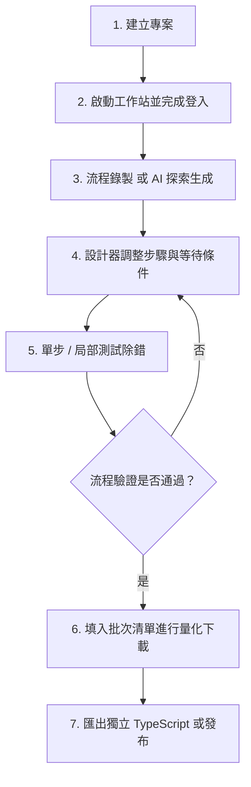

# 網站自動化流程設計平台 · Automation Studio

**Automation Studio** 是一套專為 Windows 環境打造的本機視覺化網頁自動化流程設計、錄製、除錯與批次執行平台。結合 **Playwright** 瀏覽器自動化引擎、**React 19** 現代化視覺操作介面、**AI 流程探索助理** 以及 **Model Context Protocol (MCP)** 服務架構，協助使用者以低代碼方式快速建立穩定、可維護的網頁資料擷取與自動化作業流程。

---

## 目錄

- [一、快速開始](#一快速開始)
  - [系統需求](#系統需求)
  - [啟動與停止](#啟動與停止)
  - [環境設定與憑證](#環境設定與憑證)
- [二、核心功能介紹](#二核心功能介紹)
  - [1. 瀏覽器工作站與連線模式](#1-瀏覽器工作站與連線模式)
  - [2. 視覺化流程設計器](#2-視覺化流程設計器)
  - [3. 批次任務與多工並行](#3-批次任務與多工並行)
  - [4. AI 流程助理與站台探索](#4-ai-流程助理與站台探索)
  - [5. 測試、除錯與執行紀錄](#5-測試除錯與執行紀錄)
  - [6. 成果匯出與發布](#6-成果匯出與發布)
  - [7. Playwright MCP 與擴充整合](#7-playwright-mcp-與擴充整合)
- [三、建議標準操作流程](#三建議標準操作流程)
- [四、重要注意事項與最佳實踐](#四重要注意事項與最佳實踐)
- [五、目錄架構與檔案儲存](#五目錄架構與檔案儲存)
- [六、開發與建置說明](#六開發與建置說明)

---

## 一、快速開始

### 系統需求
- **作業系統**：Windows 10 / Windows 11 (64-bit)
- **Node.js 執行環境**：Node.js 22 或以上版本（支援隨附可攜式 `runtime\node\` 或本機已安裝之 Node.js）
- **瀏覽器環境**：隨附之 Chromium、本機 Google Chrome 或既有 Playwright 瀏覽器快取

### 啟動與停止

1. **啟動平台**：
   - 雙擊執行專案根目錄的 `start.bat`。
   - 系統啟動本機伺服器後，會自動在預設瀏覽器中開啟首頁：`http://127.0.0.1:4173`。
2. **停止平台**：
   - 雙擊執行根目錄的 `stop.bat`，即可安全終止背景執行的 Studio 伺服器程序。

### 環境設定與憑證

若需自訂連接埠或設定 AI 金鑰，可複製 `.env.example` 為 `.env` 進行微調：

```ini
# 服務連接埠（預設 4173）
UI_PORT=4173

# 預設檔案下載儲存路徑
DOWNLOAD_DIR=./downloads

# AI 服務供應商金鑰（可選，亦可於介面設定中填入）
GEMINI_API_KEY=
OPENAI_API_KEY=
```

> [!TIP]
> **公司企業網路 HTTPS 憑證說明**：
> `start.bat` 預設啟用 `NODE_USE_SYSTEM_CA=1`，讓 Node.js 與 Playwright 自動使用 Windows 系統憑證庫，避免企業防火牆 SSL 檢驗產生 `unable to get local issuer certificate` 錯誤。若有專屬內部根憑證，可於環境變數指定 `NODE_EXTRA_CA_CERTS=C:\path\to\company-ca-chain.pem`。

---

## 二、核心功能介紹

### 1. 瀏覽器工作站與連線模式

工作站支援三種核心模式，兼顧錄製便利性、反偵測能力與現有登入狀態沿用：

- **隨附 Chromium（建議模式）**：
  - 獨立有頭/無頭瀏覽器，支援「**保留登入狀態**」（持久化 Profile）。登入後的 Cookie、Session Storage 會自動保存在本機，下次執行無需反覆登入。
  - 支援「**Stealth 防偵測**」擴充插件，有效避開常見的自動化機器人檢測。
- **接管現有 Chrome（CDP 模式）**：
  - 透過 Chrome DevTools Protocol (CDP, 預設 `http://127.0.0.1:9222`) 連線至您日常開啟的 Chrome 瀏覽器。
  - 直接共用您日常的瀏覽器分頁、書籤與已登入帳號；工作完成後 Chrome 保持開啟，不影響使用者日常作業。
  - 支援一鍵自動尋找本機 Chrome 並以獨立除錯 Profile 啟動，亦可使用根目錄的 `start-chrome-cdp.bat` 啟動。
- **背景無頭模式 (Headless)**：
  - 適用於測試穩定的流程或排程批次作業，以無介面背景方式高效執行。

---

### 2. 視覺化流程設計器

設計器提供直覺的階層式步驟管理與即時視覺化畫布：

- **互動與佈局**：
  - **單擊選取 / 雙擊開啟設定**：點擊步驟卡可選取檢視，雙擊開啟右側詳細設定抽屜。
  - **拖曳排序與插入**：長按卡片即可在同層級自由拖曳排序；拖曳至目標卡片上緣插入前方、中央交換、下緣插入後方。
  - **條件分支收折**：True / False 條件分支與迴圈區塊可獨立收折，保持長流程的清晰度。
  - **全螢幕畫布檢視**：支援畫布全螢幕放大檢視（按 Esc 退出）。
- **豐富的動作元件庫**：
  - **網頁互動**：點擊、雙擊、輸入文字、下拉選單選取、單選/複選框勾選、鍵盤按鍵與快速鍵。
  - **懸停與延遲**：Hover 懸停選單、等待固定秒數、等待元素可見/消失、等待特定文字出現。
  - **資料擷取與變數**：
    - 「擷取文字」：提取純文字、HTML 或指定屬性至流程變數 `{{varName}}`。
    - 「擷取樣式 (Regex)」：使用正規表示式從文字中抽取驗證碼、代碼或特定金額。
    - 「複製至剪貼簿」：將動態變數內容複製至本機剪貼簿供跨頁面使用。
  - **原生保存頁面 PDF**：
    - 直接調用 Chromium 原生列印功能保存目前頁面，不依賴網頁按鈕。
    - 支援設定 A4/Letter、直向/橫向、邊界（mm）、縮放比例（10%–200%）以及 HTML 頁首/頁尾範本。
  - **智慧檔案下載**：
    - 支援「直接連結下載」與「點擊等待下載」，在瀏覽器層級擷取回應串流。
    - 支援動態命名與檔名防覆蓋機制（自動遞增序號）。
  - **人工操作等待步驟 (Human-in-the-Loop)**：
    - 遇驗證碼 (CAPTCHA)、簡訊 OTP、硬體憑證登入時，流程會自動暫停，等待使用者在瀏覽器完成人工操作。
    - 支援三種繼續條件：使用者手動點擊「繼續執行」、指定完成元素出現、或網址符合條件。

---

### 3. 批次任務與多工並行

適合處理大量資料清單的循環作業（例如依統一編號清單逐筆下載報表）：

- **批次內容匯入與匯出**：
  - 支援 **JSON** 與 **UTF-8 CSV**（含 BOM，Excel 直接開啟不亂碼）。
  - 自動對應流程參數 Key，保留資料類型，密碼等機敏參數預設不匯出。
  - 支援每列獨立「執行勾選」，匯入時可選擇「加入目前清單」或「完全取代」。
- **最多 3 筆並行執行 (Concurrency)**：
  - 於「批次任務 → 進階設定 → 容錯與並行」可選擇同時執行數 1、2 或 3。
  - 採用**獨立瀏覽器工作站隔離**（Worker 1、2、3 各自使用專屬 Profile 子目錄與 Session），任務互不干擾。
  - 同名下載檔案採原子鎖定預留檔名，確保並行寫入不互相覆蓋。

---

### 4. AI 流程助理與站台探索

內建多模型 AI 助理，能理解自然語言需求並自動轉化為操作步驟：

- **真實站台探索 (Site Exploration)**：
  - AI 助理在產生流程前，會先以可見瀏覽器載入目標網站進行頁面探索。
  - **嚴格防幻覺機制**：AI 僅能選用當前 DOM 實際存在的真實元素與 selector，大幅提升生成成功率。
  - 機敏性操作（如涉及送出、刪除或付款）會主動暫停提示人工接管。
- **對話式流程修訂與差異比對**：
  - 支援多輪對話修改已有流程，畫面即時以顏色標籤呈現「新增、修改、刪除」差異。
  - 確認滿意後一鍵套用至專案，並提供本機版本快照還原功能。
- **多模型供應商支援**：
  - 支援 Google Gemini、OpenAI、Ollama（本機離線模型）及自訂 OpenAI-Compatible Gateway。

---

### 5. 測試、除錯與執行紀錄

- **單步與局部測試**：
  - 支援「**只執行此步驟**」與「**從此步驟執行**」，除錯時無需每次從頭重跑登入與前置操作。
- **執行監控與失敗 AI 診斷**：
  - 即時呈現目前執行階段、動作、耗時與目標 selector。
  - 流程失敗時，內建 AI 自動根據失敗頁面元素、Console Log 與錯誤訊息分析根本原因，並給出修復建議。
- **完整執行證據包**：
  - 記錄每次運行的步驟歷程、頁面截圖、DOM 結構快照、網路請求與下載檔案清單。
  - 支援一鍵下載「失敗診斷包 ZIP」。
- **磁碟空間管理**：
  - 支援設定 Debug 與歷程資料保留天數，每日自動清理到期暫存，保護本機儲存空間。

---

### 6. 成果匯出與發布

專案可隨時打包匯出為獨立執行的發布檔：

| 匯出格式 | 包含內容與用途 |
| :--- | :--- |
| **可攜工作流程 ZIP** | 包含 Workflow JSON、參數 Schema、Selectors 定義與 README，可分享至其他 Studio 匯入。 |
| **獨立 TypeScript 專案** | 完整的 Node.js + Playwright 專案程式碼，附帶 `start.bat` 與型別定義，可脫離 Studio 獨立於伺服器排程執行。 |
| **Agent `SKILL.md` 規格** | 結構化的自動化代理操作規格，供 AI Agent（如 Claude / Gemini）了解並排程呼叫。 |

> [!NOTE]
> 匯出時系統會自動剔除密碼、Cookie、Token 與個人 Profile，確保分享安全。

---

### 7. Playwright MCP 與擴充整合

- **Model Context Protocol (MCP)**：
  - 內建標準 MCP 工具伺服器（[src/mcp/server.ts](file:///c:/Users/homeuser/AI/網頁自動化/automation-studio-generic-v2.0.2/src/mcp/server.ts)），對外提供高階任務型工具介面（如建立下載任務、查詢下載狀態、取得產物）。
- **EBAS 報表既有模組**：
  - 既有政府採購與預算系統 (EBAS) 報表下載模組完整保留於 `/legacy/` 路徑，並可使用 `start-ebas-ui.bat` 獨立啟動。

---

## 三、建議標準操作流程



1. **建立專案**：在「專案總覽」點擊新增專案，輸入名稱與目標起始網址。
2. **登入準備**：切換至「網站與工作站」，啟動隨附瀏覽器，手動完成網站登入與安全性驗證。
3. **錄製步驟**：按「開始錄製」，依序操作目標網頁（點擊、查詢、翻頁、下載），系統自動擷取最佳 selector。
4. **精準修訂**：回到「自動化設計器」，為動態欄位設定 `{{變數}}`，為關鍵步驟加入「等待元素」或「人工操作」中斷點。
5. **分段除錯**：使用「只執行此步驟」確認 selector 與資料擷取無誤。
6. **批次執行**：至「批次任務」匯入 CSV/JSON 資料清單，設定並行數 1–3 展開自動化抓取。
7. **專案產出**：至「發布與版本」下載成果 ZIP 或 TypeScript 專案。

---

## 四、重要注意事項與最佳實踐

1. **面對驗證碼 (CAPTCHA) 與多因素認證 (MFA)**：
   - 請勿嘗試使用腳本暴力破解圖形驗證碼或滑塊驗證，這極易導致 IP 被封鎖。
   - 正確做法：在流程設計中加入**「人工操作」步驟**，設定網址或元素等待條件；自動化執行到該處時會發出提示並等待使用者手動完成。
2. **機敏資訊保護**：
   - 帳號密碼等敏感資料請於「參數管理」中將其標記為**「機敏參數」**。
   - 標記為機敏之參數不會寫入一般日誌，匯出專案與批次檔案時會自動清空預設值。
3. **請求頻率與防封鎖策略**：
   - 避免將步驟等待時間設為 0。建議在操作之間保留合理停頓（預設每步 800ms）。
   - 若目標網站設有單帳號連線限制，批次任務請保持「同時執行數 = 1」，切勿冒然開啟高並行。
   - 若遇到 HTTP 429 (Too Many Requests) 或 403 警告，應適度調大重試間隔或切換為 CDP 模式。
4. **企業網路憑證**：
   - 遭遇 SSL 檢驗報錯時，確認是否已啟用系統憑證庫支援，切勿隨意在正式環境全域關閉 TLS 安全檢查。

---

## 五、目錄架構與檔案儲存

執行期間產生的資料依功能分流存放，建議定期備份或清理：

```text
automation-studio-generic/
├── start.bat                  # 快速啟動批次檔
├── stop.bat                   # 停止服務批次檔
├── src/                       # 後端核心、MCP 伺服器與 Playwright 執行引擎
├── frontend/                  # React 19 SPA 前端原始碼
├── public/                    # 前端建置產物與靜態資源
│   └── modern/                # 前端 SPA 頁面與 Monaco 核心元件
├── data/
│   ├── profiles/              # 各專案持久化瀏覽器設定檔（Cookie、Session）
│   └── studio/                # 專案設定檔與歷程日誌 (JSON)
├── downloads/                 # 自動化下載成果儲存目錄
├── debug/                     # 執行錯誤快照、截圖與除錯封包
└── graphify-out/              # 架構知識圖譜分析成果 (graph.html)
```

---

## 六、開發與建置說明

如需對本專案進行二次開發或調整前端介面：

### 前端 React SPA 開發與建置
```bash
# 1. 前端 TypeScript 型別檢查
npm run frontend:check

# 2. 建置前端 SPA 產物並安裝至 public/modern
npm run frontend:build

# 3. 完整專案語法與型別檢查
npm run check:all
```

### 執行單元與整合測試
```bash
# 執行後端與流程測試
npm test
```

---

*網站自動化流程設計平台 · Automation Studio*
